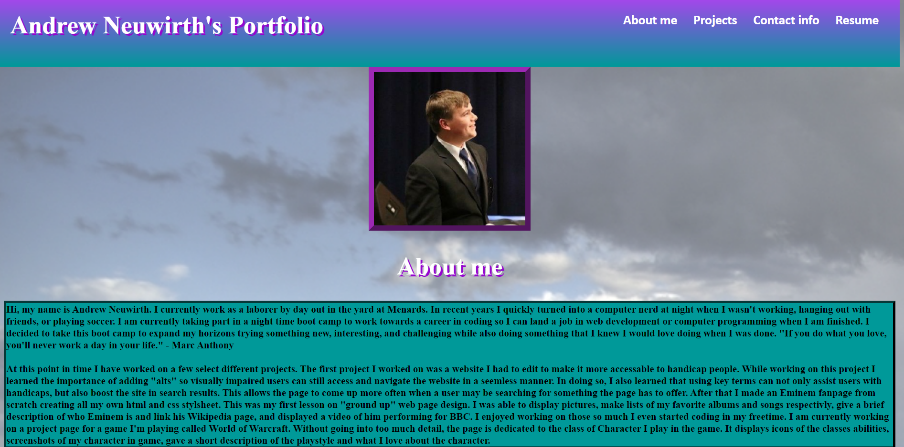

# Portfolio

## Description

Provide a short description explaining the what, why, and how of your project. Use the following questions as a guide:

- I made this portfolio to display my skills as a web developer by showing CSS skills on deployed page, and showcasing past projects for you to look through.
 I wanted to show my web development "arsenal" vicariously through the site you're going to view. Here you'll be able to learn alittle about me personally and about how I came into the field.
 You'll be able to get a glimpse, and even navigate to previous projects i've worked on. You'll be able to view my formal resume, as well as finding my contact information including my Github and 
 LinkedIn.

 ## Portfolio 

## Deployed Portfolio

{ https://neuy16.github.io/Portfolio/ }